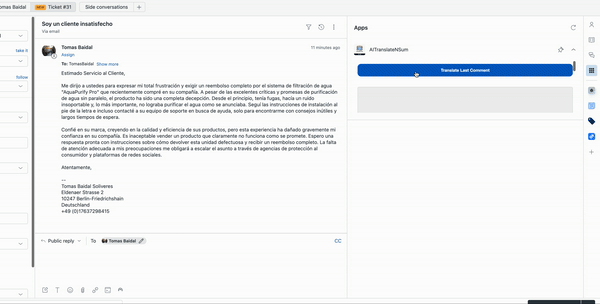
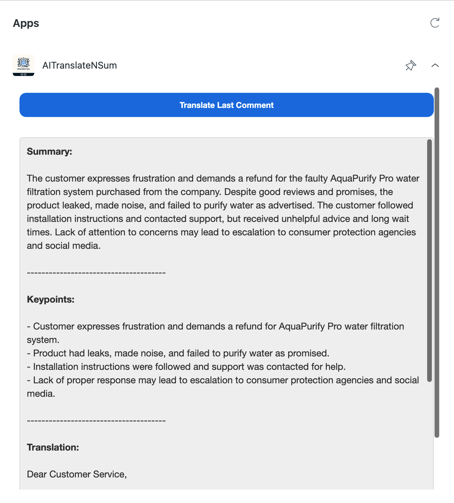
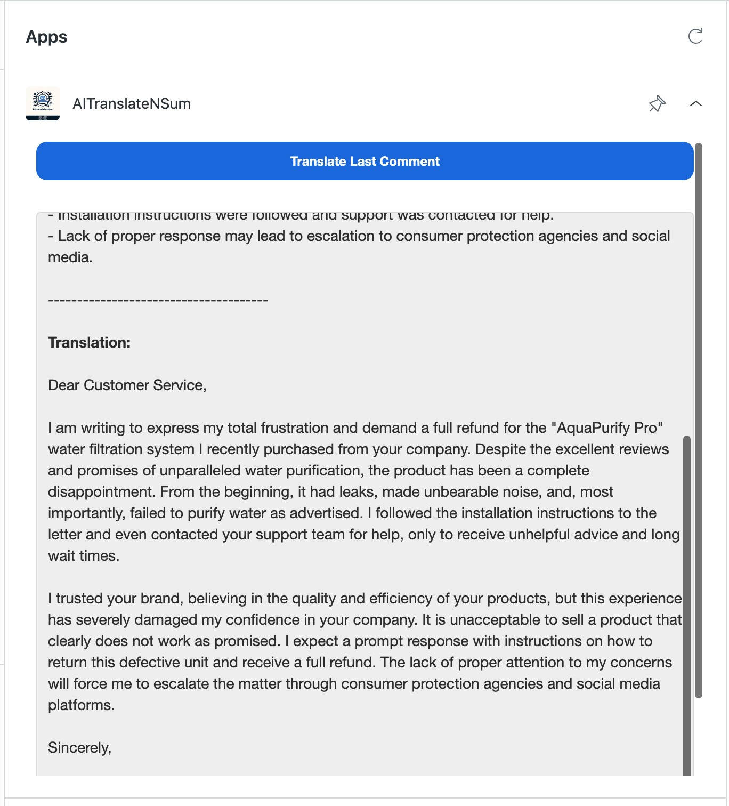

# AI Translate N Sum for Zendesk

AITranslateN'Sum is a Zendesk Support that summarizes and translates the last customer comment on a ticket, providing support agents with valuable insights and removing language barriers between agents and customers.


### The following information is displayed:

* **Summarization:** Generate concise summaries of the last customer comment to quickly grasp the customer's issue.
* **Key Points Extraction:** Identify and list key points from the customer's comment, making it easier for agents to address specific concerns.
* **Translation:** Translate the last customer comment into **English**, aiding agents in understanding and responding to non-English speaking customers.

### Model and Prompt

AITranslateN'Sum uses the "gpt-3.5-turbo" model as its default for processing tickets. This model was chosen for its efficiency in understanding and generating human-like text, making it ideal for summarizing and translating customer support tickets.

The app employs a specific prompt structure to communicate with OpenAI's API, ensuring that the response is formatted to include a summary, keypoints, and a translation of the customer's ticket. Here is the prompt structure used:

```
Generate a summary of the following text '[customer_ticket_text]' in English. Then create bulletpoints for the keypoints of the text. Translate the following text to English: '[customer_ticket_text]'.
The structure of your reply should always be:


<strong>Summary:</strong>

"the summary of the text"

--------------------------------------

<strong>Keypoints:</strong>

"the bulletpoints created"

--------------------------------------

<strong>Translation:</strong>

"Translation of the text"

If the text is already in English, create the summary and just paste the same content for the translation.

```


### Installation

* Clone or download this repository to your local machine.
* Install the app in your Zendesk Support account as a private app. For detailed instructions on installing private apps, refer to the Zendesk Support documentation.
* After installation, you will need to enter your OpenAI API key. Make sure to have your OpenAI API key ready.

### Usage

Once installed and configured, the app will appear in the ticket sidebar within Zendesk Support. To use the app, simply:

* Open a ticket.
* Click the "Translate Last Comment" button in the app's sidebar panel.
* The app will display a summary, key points, and a translation of the last customer comment in the panel below the button.

  
## Demo Video




## Screenshots




## Support

For support, questions, or feedback, please [create an issue](https://github.com/tbs89/zendesk_aitranslateNsum/issues/new/choose) in this repository.


